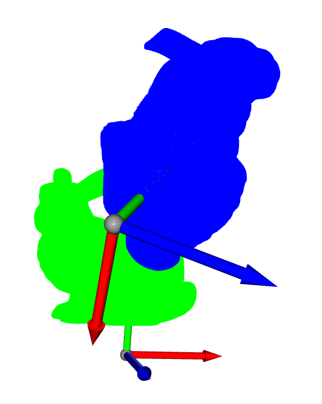
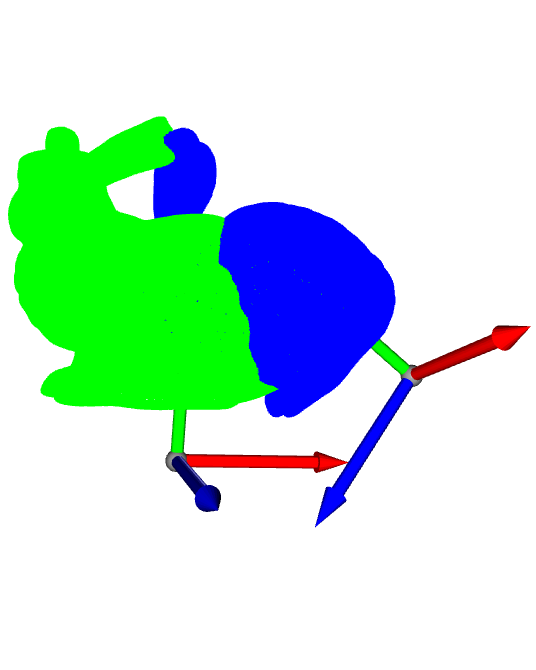
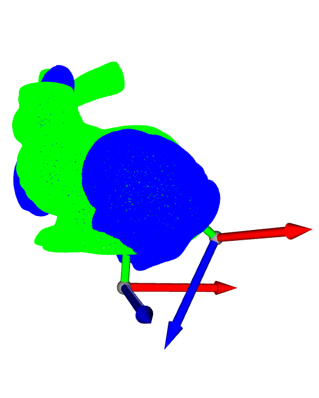
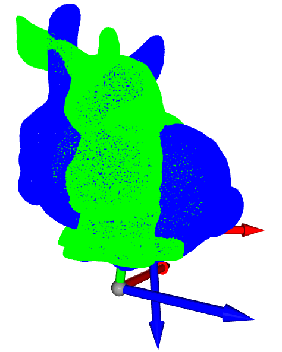
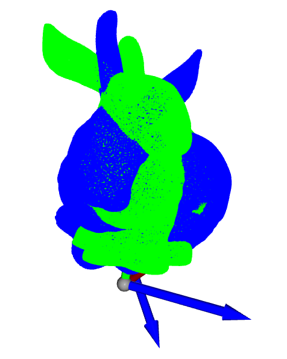
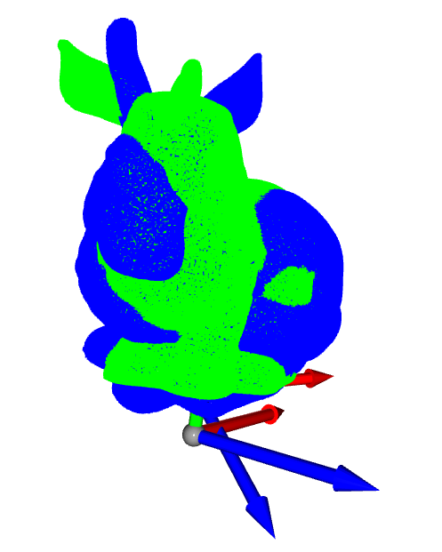
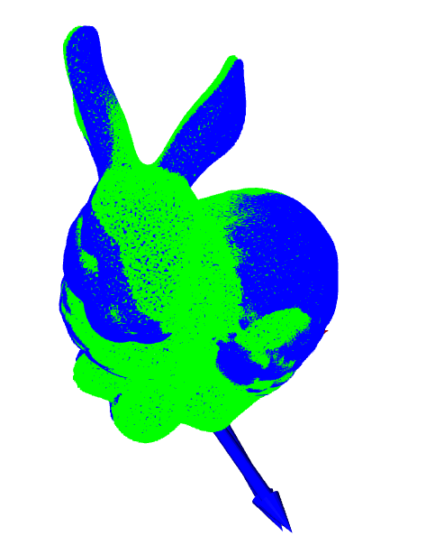
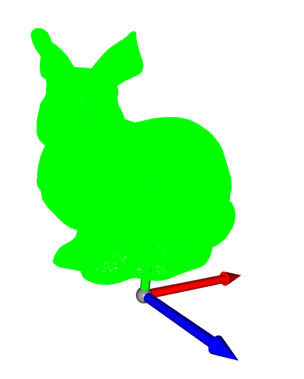

# Iterative Closest Point (Basic Algorithm from scratch)

The file icp.py contains the code for iterative closest point. It expects two pointclouds - Q and P. The code estimates the transformation needed such that Q and P are aligned. It does not use any inbuilt function, and uses Open3D for visualization. The correspondences between the points in the pointclouds are not known. Following is the output of the code. 

  
   
  
  
   
  
  
   
  

